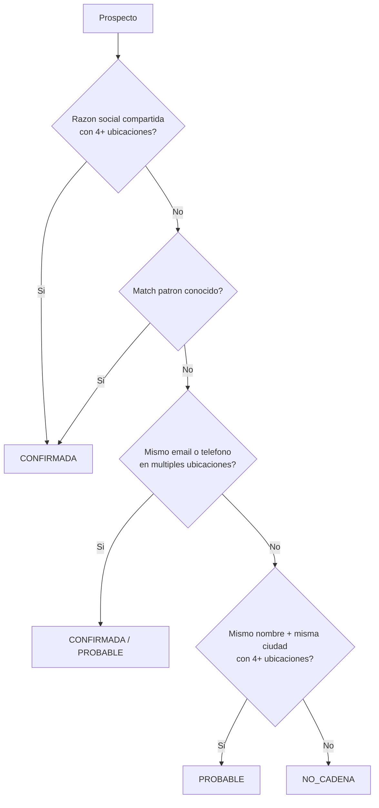

```js
import {kpi, formatNumber} from "./components/ui.js";
import {decisionCallout} from "./components/brand.js";
```

<h1 style="display: flex; align-items: center; gap: 0.5rem;">
  <span style="font-size: 1.5rem;">📊</span> Metodología y Fuentes de Datos
</h1>

<p style="color: #666; margin-top: 0;">
  Documentación técnica del proceso de análisis, fuentes de datos y criterios utilizados para la identificación de oportunidades de expansión.
</p>

---

## Resumen Ejecutivo

Este análisis de expansión nacional para FCarnes utiliza una metodología de **inteligencia geoespacial** que combina múltiples fuentes de datos públicos y privados para identificar, priorizar y validar prospectos comerciales en el sector cárnico de México.

```js
display(kpi([
  { label: "Fuentes de Datos", value: "5", subtitle: "Integradas" },
  { label: "TAM Bruto Analizado", value: "79,620", subtitle: "Mercado Total" },
  { label: "Prospectos Verificados", value: "30,915", subtitle: "38.8% pasó filtros" },
  { label: "Macro-Regiones", value: "9", subtitle: "Cobertura nacional" }
]));
```

---

## ⚠️ Definición de "Calidad" (Filtros Aplicados)

<div class="card" style="background: linear-gradient(135deg, #fef3c7 0%, #fef9c3 100%); border-left: 4px solid #f59e0b; margin: 1rem 0;">
  <h4 style="margin: 0 0 0.75rem 0; color: #92400e;">
    ¿Qué significa "Prospectos Verificados" o "Filtrados por Calidad"?
  </h4>
  <p style="margin: 0 0 0.75rem 0; font-size: 0.9rem; color: #78350f; line-height: 1.6;">
    Cuando decimos que un prospecto es "verificado" o de "alta calidad", significa que pasó <strong>7 criterios específicos</strong> de filtrado:
  </p>
  <ol style="margin: 0; padding-left: 1.5rem; font-size: 0.9rem; color: #78350f; line-height: 1.8;">
    <li><strong>Todos los Tiers:</strong> Incluye todos los niveles de prioridad — Scoring v4 usa dos sistemas (tier por tipo y tier por score percentil)</li>
    <li><strong>Score ≥ 35:</strong> Puntuación mínima de relevancia basada en canal, tamaño y ubicación</li>
    <li><strong>Datos de contacto:</strong> Tiene teléfono, email, web o reseñas verificables en Google</li>
    <li><strong>Coordenadas precisas:</strong> Mínimo 4 decimales de precisión (~11 metros)</li>
    <li><strong>Nombre específico:</strong> Excluye nombres genéricos como "CARNICERIA", "EXPENDIO", etc.</li>
    <li><strong>Negocio activo:</strong> No marcado como cerrado en Google Maps</li>
    <li><strong>Completitud ≥ 30%:</strong> Score mínimo de datos completos en el registro</li>
  </ol>
  <p style="margin: 0.75rem 0 0 0; font-size: 0.85rem; color: #92400e; background: white; padding: 0.5rem; border-radius: 4px;">
    <strong>Resultado:</strong> De 79,620 registros iniciales → 30,915 prospectos verificados (38.8% de retención).
  </p>
</div>

---

## 🎯 Priorización por Zona Geográfica (Scoring Diferenciado)

<div class="card" style="background: linear-gradient(135deg, #ede9fe 0%, #f5f3ff 100%); border-left: 4px solid #8b5cf6; margin: 1rem 0;">
  <h4 style="margin: 0 0 0.75rem 0; color: #5b21b6;">
    Reglas de Priorización Aplicadas
  </h4>
  <p style="margin: 0 0 0.75rem 0; font-size: 0.9rem; color: #4c1d95; line-height: 1.6;">
    Además del filtrado de calidad, se aplica una <strong>priorización estratégica</strong> basada en la ubicación geográfica y el tipo de negocio:
  </p>
</div>

### Zona Metropolitana de Monterrey

En los **16 municipios** de la ZM Monterrey (Monterrey, San Nicolás, Guadalupe, Apodaca, San Pedro, Santa Catarina, General Escobedo, Juárez, García, Cadereyta, Santiago, Salinas Victoria, Ciénega de Flores, General Zuazua, Pesquería, El Carmen):

| Tipo de Negocio | Prioridad | Razón |
|-----------------|-----------|-------|
| **Bodegones, Retailers Medianos/Grandes** | ⭐ **Alta** | Volumen y frecuencia de compra |
| **Mayoristas** | ⭐ **Alta** | Canal B2B estratégico |
| **Procesadoras de Carne** | ❌ **Excluidas** | No son target comercial |
| **Retail Individual** | ⚪ Normal | Scoring estándar |

### Fuera de Nuevo León (Exterior)

Para el resto del país, la priorización se basa en la **detección de cadenas con criterios estrictos**:

| Criterio | Prioridad | Confianza |
|----------|-----------|-----------|
| **Misma razón social (DENUE)** | ⭐⭐ **Máxima** | CONFIRMADA |
| **Patrón conocido (Perplexity)** | ⭐⭐ **Máxima** | CONFIRMADA |
| **Mismo email/teléfono** | ⭐ **Alta** | CONFIRMADA/PROBABLE |
| **Mismo nombre + misma ciudad** | ⚪ **Media** | PROBABLE |
| **Retail individual** | ⚪ Normal | Scoring estándar |

### Cadenas Regionales Identificadas (Investigación Perplexity + DENUE)

Las siguientes cadenas fueron identificadas mediante investigación de mercado y validadas con conteo de sucursales en DENUE:

<div class="grid grid-cols-3">
  <div class="card">
    <h5 style="margin: 0; color: #1e40af;">🔵 Baja California</h5>
    <ul style="margin: 0.5rem 0; font-size: 0.85rem; padding-left: 1rem;">
      <li><strong>El Florido</strong> - 6+ sucursales</li>
      <li><strong>Las Nenas</strong> - 4+ sucursales</li>
      <li><strong>El Tío</strong> - 4+ sucursales</li>
    </ul>
  </div>
  <div class="card">
    <h5 style="margin: 0; color: #1e40af;">🔵 Coahuila</h5>
    <ul style="margin: 0.5rem 0; font-size: 0.85rem; padding-left: 1rem;">
      <li><strong>Bodegas Omerca</strong> - 4+ sucursales</li>
      <li><strong>La Cabaña</strong> - 4+ sucursales</li>
      <li><strong>Carnes Finas del Norte</strong> - 5+ suc</li>
    </ul>
  </div>
  <div class="card">
    <h5 style="margin: 0; color: #1e40af;">🔵 Otros Estados</h5>
    <ul style="margin: 0.5rem 0; font-size: 0.85rem; padding-left: 1rem;">
      <li><strong>Carnes JC</strong> - Sonora</li>
      <li><strong>Alicarnes</strong> - Querétaro</li>
      <li><strong>Mi Granja San Agustín</strong> - 6 estados</li>
    </ul>
  </div>
</div>

### Algoritmo de Detección de Cadenas (v3 - Criterios Estrictos)

La detección de cadenas utiliza **5 métodos** ordenados por nivel de confianza para minimizar falsos positivos:

| # | Método | Confianza | Criterio |
|---|--------|-----------|----------|
| 1 | **RAZON_SOCIAL** | 🟢 Máxima | Misma razón social exacta en 4+ ubicaciones |
| 2 | **PATRON** | 🟢 Máxima | Cadenas conocidas (CarneMart, SuKarne, etc.) |
| 3 | **EMAIL** | 🟡 Alta | Mismo correo electrónico en 4+ ubicaciones |
| 4 | **TELEFONO** | 🟠 Media-Alta | Mismo teléfono en 3+ ubicaciones |
| 5 | **CIUDAD_NOMBRE** | 🟠 Media | Mismo nombre en misma ciudad (4+ ubicaciones) |



**Resultados v3.2 (con Fuzzy Matching):**
- **574 cadenas** detectadas (vs ~18,600 sin criterios estrictos)
- **295 CONFIRMADAS** (razón social, patrón, email)
- **279 PROBABLES** (teléfono, nombre+ciudad)
- Fuzzy matching captura variaciones: "SUKARNE SA DE CV" ≈ "SU KARNE S.A. DE C.V."
- Falsos positivos eliminados: nombres genéricos, nombres comunes mexicanos
- Top cadenas: SUKARNE, DISTRIBUIDORA SUCAHERZA, Carnes Finas San Juan, ABASTECEDORA CARNICOS

---

## 1. Fuentes de Datos

### 1.1 DENUE (INEGI)

<div class="card">

**Directorio Estadístico Nacional de Unidades Económicas**

| Atributo | Valor |
|----------|-------|
| **Fuente** | INEGI - Instituto Nacional de Estadística y Geografía |
| **Fecha de extracción** | Diciembre 2024 |
| **Códigos SCIAN utilizados** | 461121, 461122, 311611, 311612, 311615 |
| **Registros extraídos** | 79,175 unidades económicas |

**Campos utilizados:**
- Nombre del establecimiento y razón social
- Coordenadas geográficas (lat/lon)
- Código de actividad económica (SCIAN)
- Personal ocupado
- Dirección completa
- **Teléfono** (39.4% de cobertura)
- Clave de entidad, municipio y localidad

</div>

### 1.2 Google Maps / Places API

<div class="card">

**Enriquecimiento con datos de Google**

| Atributo | Valor |
|----------|-------|
| **API utilizada** | Google Places API |
| **Prospectos enriquecidos** | 866 |
| **Campos adicionales** | Rating, reviews, horarios, teléfono verificado |

**Campos utilizados:**
- Rating promedio (1-5 estrellas)
- Número de reseñas
- Horarios de operación
- Teléfono verificado
- Indicador de apertura en sábado

</div>

### 1.3 Ruteo y Costos Logísticos (HERE + Sakbe)

<div class="card">

**Sistema de cálculo de rutas y costos logísticos**

| Atributo | Valor |
|----------|-------|
| **APIs utilizadas** | HERE Routing API + INEGI Sakbe |
| **Rutas principales calculadas** | 16 destinos estratégicos |
| **Rutas con casetas** | 15 (94%) |
| **Distancia máxima** | 2,600 km (Tijuana) |

**Métricas obtenidas:**
- Distancia en kilómetros (ruta óptima por carretera)
- Tiempo estimado de viaje
- Zonas de cobertura logística
- Geometría de rutas para visualización en mapa

</div>

### 1.4 Street View + GPT-4o Vision

<div class="card">

**Análisis visual con inteligencia artificial**

| Tier | Total | Con IA | Cobertura |
|------|------:|-------:|----------:|
| **A_PREMIUM** | 377 | 274 | 72.7% |
| **B_ALTA** | 22,052 | 22,012 | **99.8%** |
| **Total Prioritarios** | 22,429 | 22,286 | **99.4%** |

| Atributo | Valor |
|----------|-------|
| **Modelo utilizado** | GPT-4o Vision |
| **Método de procesamiento** | Análisis por lotes automatizado |

**Métricas de IA generadas:**
- Vitalidad comercial de la escena (1-10)
- Visibilidad del negocio desde la calle (1-10)
- Condición de la fachada (1-10)
- Target encontrado (sí/no)
- Tipo de calle y densidad urbana

**Prospectos sin análisis IA:**
- A_PREMIUM sin IA (103): Sin cobertura Street View en ubicaciones rurales
- B_ALTA sin IA (40): Diferencias menores de coordenadas que impidieron match

</div>

### 1.5 Datos del Cliente (FCarnes)

<div class="card">

**Base de clientes actuales**

| Atributo | Valor |
|----------|-------|
| **Clientes únicos** | 3,368 |
| **Cobertura de ciudades** | 129 ciudades |
| **Período de referencia** | 2024-2025 |

**Campos utilizados:**
- Nombre del cliente
- Ciudad y ruta asignada
- Tipo (Local/Foráneo)
- Fecha de alta

</div>

---

## 2. Proceso de Análisis

### 2.1 Pipeline de Datos

El proceso de generación de prospectos sigue un flujo de 8 etapas:

<div class="grid grid-cols-4" style="gap: 0.5rem; margin: 1rem 0;">
  <div style="background: #E3F2FD; padding: 0.75rem; border-radius: 6px; text-align: center; font-size: 0.85rem;">
    <strong>1. Extracción</strong><br>
    <span style="color: #666;">DENUE INEGI</span>
  </div>
  <div style="background: #E8F5E9; padding: 0.75rem; border-radius: 6px; text-align: center; font-size: 0.85rem;">
    <strong>2. Limpieza</strong><br>
    <span style="color: #666;">Dedupe + Normalización</span>
  </div>
  <div style="background: #FFF3E0; padding: 0.75rem; border-radius: 6px; text-align: center; font-size: 0.85rem;">
    <strong>3. Enriquecimiento</strong><br>
    <span style="color: #666;">Google Maps API</span>
  </div>
  <div style="background: #FCE4EC; padding: 0.75rem; border-radius: 6px; text-align: center; font-size: 0.85rem;">
    <strong>4. Scoring</strong><br>
    <span style="color: #666;">Ranking por canal</span>
  </div>
</div>

<div class="grid grid-cols-4" style="gap: 0.5rem; margin: 1rem 0;">
  <div style="background: #F3E5F5; padding: 0.75rem; border-radius: 6px; text-align: center; font-size: 0.85rem;">
    <strong>5. Logística</strong><br>
    <span style="color: #666;">HERE + Sakbe</span>
  </div>
  <div style="background: #E0F7FA; padding: 0.75rem; border-radius: 6px; text-align: center; font-size: 0.85rem;">
    <strong>6. Análisis IA</strong><br>
    <span style="color: #666;">GPT-4o Vision</span>
  </div>
  <div style="background: #FBE9E7; padding: 0.75rem; border-radius: 6px; text-align: center; font-size: 0.85rem;">
    <strong>7. Filtrado</strong><br>
    <span style="color: #666;">Verificación calidad</span>
  </div>
  <div style="background: #FFEBEE; padding: 0.75rem; border-radius: 6px; text-align: center; font-size: 0.85rem;">
    <strong>8. Dashboard</strong><br>
    <span style="color: #666;">Export final</span>
  </div>
</div>

### 2.2 Filtrado de Calidad

Para garantizar que **solo se entreguen prospectos verificables**, se implementó un proceso de filtrado multicapa:

<div class="card" style="border-left: 4px solid #4CAF50; background: #E8F5E9;">

**Criterios de Filtrado Aplicados:**

| Filtro | Criterio | Impacto |
|--------|----------|---------|
| **Tier** | Todos los tiers incluidos | Sistema v4 con doble clasificación (tipo + score percentil) |
| **Score mínimo** | ≥ 35 puntos | Elimina baja relevancia |
| **Completitud** | ≥ 30% de campos | Elimina registros vacíos |
| **Nombres** | Excluir genéricos | Elimina "CARNICERIA", "EXPENDIO", etc. |
| **Contacto** | Requiere teléfono, reviews o web | Elimina sin forma de contacto |

**Resultado del filtrado:**
- TAM Bruto: 79,620 prospectos
- **Prospectos Verificados: 30,915** (38.8% de alta calidad)
- Cada prospecto tiene contacto verificable

</div>

#### Niveles de Confianza

Cada prospecto filtrado recibe un nivel de confianza:

| Nivel | Criterio | Acción Recomendada |
|-------|----------|-------------------|
| **ALTA** | Validado IA + teléfono + reviews | Contactar directamente |
| **MEDIA** | Teléfono o reviews | Validar por teléfono |
| **PENDIENTE** | Solo datos básicos | Validar con Street View |

### 2.2 Criterios de Clasificación

#### Categorías de Canal FCarnes

| Categoría | Descripción | Códigos SCIAN |
|-----------|-------------|---------------|
| **MAYORISTA** | Distribuidores y mayoristas de carne | 431150, 461121 (>50 empleados) |
| **PROCESO** | Obradores, rastros, empacadoras | 311611, 311612, 311615 |
| **RETAIL_CONSOLIDADO** | Carnicerías establecidas | 461121 (6-50 empleados) |
| **RETAIL_MICRO** | Carnicerías de barrio | 461121 (0-5 empleados) |
| **SUPERMERCADO** | Tiendas de autoservicio | 462111 |

#### Tiers de Prioridad (Sistema v4)

**Sistema Dual de Clasificación:**

El sistema v4 utiliza dos clasificaciones complementarias:

**1. Tier por Tipo de Cliente** (`tier_fcarnes`): Basado en la categoría de negocio

| Tier | Tipos de Cliente | Justificación |
|------|------------------|---------------|
| **Tier 1** | Mayoristas, Cadenas grandes, Procesadores, Empacadoras | Máximo volumen y valor estratégico |
| **Tier 2** | Supermercados regionales, Carnicerias premium, HORECA alto volumen | Alto potencial y profesionalización |
| **Tier 3** | Carnicerias consolidadas, Obradores, Restaurantes, Taquerias individuales | Volumen medio, mercado masivo |
| **Tier 4** | Carnicerias micro, Minisupers, Cremerias | Bajo volumen individual |

**2. Tier por Score** (`tier_final`): Basado en percentiles de desempeño

| Tier | Percentil | Umbral Score | Proporción |
|------|-----------|--------------|------------|
| **TIER_1_PREMIUM** | Top 5% | Score ≥ 27.9 | ~5% del total |
| **TIER_2_ALTA** | Top 20% | Score ≥ 21.1 | ~15% del total |
| **TIER_3_MEDIA** | Medio 50% | Score ≥ 15.7 | ~50% del total |
| **TIER_4_BAJA** | Bottom 30% | Score < 15.7 | ~30% del total |

Los umbrales se calculan dinámicamente según la distribución real de scores, garantizando una segmentación equilibrada y útil.

### 2.3 Score v4 (Scoring Diferenciado)

El score v4 (0-100) combina cuatro componentes ponderados según el tipo de cliente y ubicación:

```
Score v4 = (Componente Volumen × 40%) + (Componente Calidad × 25%) + 
           (Componente Logística × 20%) + (Componente Conversión × 15%)
```

**Componentes del Score:**

| Componente | Peso | Factores Considerados |
|------------|------|----------------------|
| **Volumen** | 40% | Tipo de cliente, tamaño estimado, personal ocupado |
| **Calidad** | 25% | Rating Google, número de reviews, horarios, datos completos |
| **Logística** | 20% | Distancia a planta, zona logística, accesibilidad |
| **Conversión** | 15% | Probabilidad de conversión según histórico por tipo |

**Ajustes Geográficos:**
- **ZM Monterrey**: Bonus para bodegones y mayoristas
- **Resto de NL**: Scoring estándar
- **Exterior**: Bonus para cadenas confirmadas (4+ sucursales)

### 2.4 Zonas Logísticas

| Zona | Distancia desde Monterrey | Frecuencia sugerida |
|------|---------------------------|---------------------|
| **LOCAL** | 0-50 km | Semanal |
| **REGIONAL** | 50-200 km | Quincenal |
| **FORÁNEA** | 200-500 km | Mensual |
| **LEJANA** | >500 km | Evaluación especial |

---

## 3. Macro-Regiones

La segmentación geográfica se realizó agrupando los 32 estados en 9 macro-regiones:

| Macro-Región | Estados | Características |
|--------------|---------|-----------------|
| **NORESTE** | NL, Coah, Tamps, SLP | Zona de origen, mercado maduro (53.6% penetración) |
| **FRONTERA_NORTE** | BC, Chih, Son, BCS | Alta demanda, logística compleja |
| **NOROESTE** | Sin, Nay, Dgo | Mercado en desarrollo |
| **BAJÍO** | Ags, Gto, Qro, Zac | Alto potencial industrial, costos moderados |
| **OCCIDENTE** | Jal, Col, Mich | Mercado grande, competido |
| **CENTRO** | CDMX, Edo.Méx, Hgo, Mor, Pue, Tlax | Mayor TAM (28,251), baja penetración |
| **GOLFO_SURESTE** | Ver, Tab, Chis, Oax, Gro | Mercado emergente, alto potencial |
| **PENÍNSULA** | QRoo, Yuc, Camp | Turismo + mercado local |
| **OTRA** | Estados sin clasificación específica | Registros pendientes de asignación |

---

## 4. Limitaciones y Consideraciones

### 4.1 Cobertura de Datos

```js
display(decisionCallout({
  title: "Consideraciones sobre los datos",
  items: [
    "Teléfonos DENUE: 39.4% de cobertura en la fuente oficial",
    "Enriquecimiento Google Maps: Aplicado a prospectos prioritarios",
    "Análisis visual IA: 99.4% de cobertura en prospectos Tier A y B",
    "Rutas logísticas: Calculadas con APIs de ruteo oficial"
  ]
}));
```

### 4.2 Rutas Logísticas Calculadas

Se calcularon 16 rutas estratégicas desde la planta de Monterrey, optimizadas para transitar exclusivamente por territorio mexicano:

| Destino | Distancia | Tiempo Estimado | Zona |
|---------|-----------|-----------------|------|
| Tijuana | 2,600 km | ~32.5 hrs | LEJANA |
| Mexicali | 2,429 km | ~30.4 hrs | LEJANA |
| Culiacán | 1,529 km | ~19.1 hrs | LEJANA |
| Puebla | 1,293 km | ~16.2 hrs | LEJANA |
| Ciudad Juárez | 1,163 km | ~14.5 hrs | LEJANA |
| Chihuahua | 800 km | ~10.0 hrs | LEJANA |
| Querétaro | 703 km | ~8.8 hrs | LEJANA |
| León | 693 km | ~8.7 hrs | FORÁNEA |
| Aguascalientes | 679 km | ~8.5 hrs | FORÁNEA |
| San Luis Potosí | 510 km | ~6.4 hrs | FORÁNEA |

### 4.3 Precisión del Análisis de IA

- **Tasa de éxito**: 99.7% de parsing exitoso en el batch B_ALTA (12,411 de 12,411)
- **Falsos negativos**: Algunos negocios no fueron identificados en Street View
- **Cobertura Street View**: 103 ubicaciones A_PREMIUM y 40 B_ALTA sin imágenes (zonas rurales)

---

## 5. Estado del Análisis y Mejoras Futuras

### 5.1 Análisis Completados ✅

| Componente | Estado | Cobertura |
|------------|--------|-----------|
| Extracción DENUE | ✅ Completado | 79,620 registros |
| Enriquecimiento Google Maps | ✅ Completado | 866 prospectos |
| Análisis IA (Tier A+B) | ✅ Completado | 22,286 prospectos (99.4%) |
| Cálculo de rutas logísticas | ✅ Completado | 16 destinos estratégicos |
| Filtrado de calidad | ✅ Completado | 30,915 verificados |
| Red logística visualizable | ✅ Completado | Rutas en mapa interactivo |

---

<small style="color: #999; display: block; text-align: center; margin-top: 2rem; padding-top: 1rem; border-top: 1px solid #eee;">
  <strong>STRTGY</strong> — Transformando complejidad en certeza<br>
  Proyecto FCarnes Expansión Nacional | Metodología v2.0 (con Filtrado de Calidad) | Enero 2026
</small>

